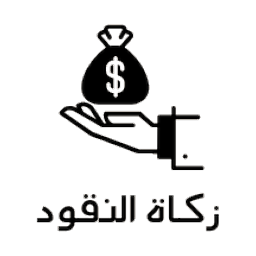
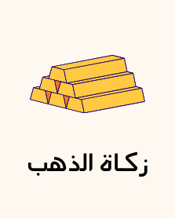
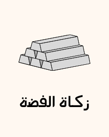
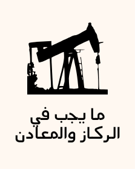

<div align="center">

  

  # 🌙 تطـبيق زكاتـي | ZakatApp
  ### المنظومة الذكية المتكاملة لحساب وإدارة الزكاة الشرعية وتتبع الحول
  
  <p align="center">
    <b>مشروع التخرج / التسليم النهائي لمادة تطوير تطبيقات الهواتف الذكية (Mobile Application Development)</b>
  </p>

  <!-- Badges -->
  <p align="center">
    <a href="https://flutter.dev/"></a>
    <a href="https://dart.dev/"></a>
    <a href="https://firebase.google.com/"></a>
    <a href="https://pub.dev/packages/provider"></a>
    <a href="https://pub.dev/packages/hive"></a>
    
    
  </p>

  <p align="center">
    <a href="#-عن-المشروع">عن المشروع</a> •
    <a href="#-المميزات-الرئيسية">المميزات الرئيسية</a> •
    <a href="#-حاسبات-الزكاة-التخصصية">حاسبات الزكاة</a> •
    <a href="#-الهيكلية-البرمجية-للشروع">الهيكلية البرمجية</a> •
    <a href="#-حزمة-التقنيات-والمكتبات">حزمة التقنيات</a> •
    <a href="#-الأمان-وحماية-البيانات">الأمان والخصوصية</a> •
    <a href="#-طريقة-التشغيل-والتثبيت">طريقة التشغيل</a> •
    <a href="#-معلومات-التسليم-الأكاديمي">بيانات التسليم</a>
  </p>

</div>

---

## 📖 عن المشروع (About The Project)

**تطبيق زكاتي (ZakatApp)** هو تطبيق هاتف ذكي متقدم مبني بإطار عمل **Flutter** وموجّه لخدمة الركن الثالث من أركان الإسلام. يجمع التطبيق بين **الدقة الفقهية الصارمة** وفق الضوابط الشرعية المعتمدة، وبين **أحدث معايير تصميم تجربة وواجهة المستخدم (UI/UX)** بأسلوب Material 3 المتطور مع دعم كامل للغة العربية والاتجاه من اليمين لليسار (RTL) والوضعين الفاتح والداكن.

يقدم التطبيق حلولاً محاسبية رقمية ذكية تشمل:
- حساب دقيق للنصاب والزكاة لمختلف الأصول (النقود، الذهب، الفضة، عروض التجارة، الزروع، الأنعام، الركاز، العملات الرقمية، وزكاة الفطر).
- متابعة الحول بالتقويمين الهجري والميلادي مع جدولة تنبيهات ذكية وتلقائية.
- نظام متكامل لإصدار ومشاركة تقارير الزكاة بصيغة PDF عالية الدقة.
- مزامنة سحابية هجينة مع Firebase مع الحفاظ على التخزين المحلي المشفر لحماية الخصوصية.
- بوابة تقديم ومتابعة طلبات المساعدة للمستحقين مع منظومة دفع وتبرع إلكترونية.

---

## ✨ المميزات الرئيسية (Key Features)

```
┌─────────────────────────────────────────────────────────────────────────────┐
│                            منظومة تطبيق زكاتي                               │
├───────────────────────┬─────────────────────────┬───────────────────────────┤
│ 🧮 9+ حاسبات فقهية     │ ⏰ تتبع الحول والتنبيهات │ 📄 تقارير PDF وفواتير     │
│ دقة رياضية وشرعية كاملة│ هجري وميلادي بدون إنترنت│ تصدير ومشاركة وطباعة فورية│
├───────────────────────┼─────────────────────────┼───────────────────────────┤
│ ☁️ مزامنة سحابية هجينة │ 🔒 أمان وتشفير بيومتري  │ 🌓 ثيم مخصص ووضع داكن     │
│ Firebase + Hive NoSQL │ بصمة إصبع + تشفير AES   │ ألوان مريحة مع أيقونات خاصة│
├───────────────────────┼─────────────────────────┼───────────────────────────┤
│ 📊 لوحة إحصائيات ورسوم│ 🤝 بوابة طلبات المساعدة  │ 💱 دعم العملات والأسعار   │
│ تحليل توزيع الأصول    │ إدارة مستحقي الزكاة     │ تحديث أسعار الذهب والفضة  │
└───────────────────────┴─────────────────────────┴───────────────────────────┘
```

### 1. 🧮 منظومة الحاسبات الشرعية الشاملة
- تغطية فقهية دقيقة لكافة أنواع الأموال والممتلكات مع التحقق التلقائي من بلوغ النصاب الشرعي وتحديد نسبة الاستحقاق.

### 2. ⏰ متابع الحول الذكي (Hawl Tracker)
- ربط تاريخ اكتمال النصاب بالتقويمين الهجري والميلادي.
- إطلاق إشعارات دورية تلقائية لتنبيه المستخدم باقتراب موعد إخراج الزكاة حتى في وضع عدم الاتصال بالإنترنت.

### 3. 📄 إصدار ومشاركة تقارير PDF
- توليد مستندات PDF احترافية ومفصلة لجميع الحسابات والسجلات التاريخية مدعومة بالرسوم والبيانات الحسابية، مع إمكانية الطباعة المباشرة والمشاركة عبر المنصات.

### 4. 🔒 الحماية الحيوية والتشفير المتقدم (Biometrics & AES Security)
- تسجيل الدخول وقفل التطبيق عبر بصمة الإصبع أو الوجه (`local_auth`).
- تشفير البيانات الحساسة والسجلات محلياً باستخدام خوارزميات التشفير المتقدمة (`crypto` و `flutter_secure_storage`).

### 5. ☁️ منظومة المزامنة السحابية وقاعدة البيانات (Hybrid Architecture)
- تخزين محلي فائق السرعة عبر `Hive NoSQL`.
- مزامنة سحابية وتوثيق للمستخدمين باستخدام `Firebase Authentication` و `Cloud Firestore`.

### 6. 🤝 بوابة طلبات المساعدة ومستحقي الزكاة
- واجهة منظمة تتيح للمستحقين تقديم طلبات المساعدة وإرفاق البيانات المطلوبة مع متابعة حالة الطلب خطوة بخطوة.

---

## 📊 حاسبات الزكاة التخصصية (Jurisprudential Calculators)

<div align="center">

| الحاسبة | الأيقونة | النصاب الشرعي | نسبة الإخراج | الميزات والتفاصيل |
| :--- | :---: | :---: | :---: | :--- |
| **زكاة النقود والسيولة** |  | ما يعادل 85غ ذهب أو 595غ فضة | **2.5%** (ربع العُشر) | حساب السيولة، الودائع، والديون المرجوة ناقص الديون العاجلة. |
| **زكاة الذهب** |  | 85 غرام عيار 24 | **2.5%** | حساب العيارات المختلفة (24، 21، 18) مع استثناء ذهب القنية والزينة المباحة. |
| **زكاة الفضة** |  | 595 غرام فضة خالصة | **2.5%** | حساب السبائك، المصوغات الفضية، والأواني الفضية المباحة. |
| **زكاة عروض التجارة** |  | نصاب الذهب أو الفضة | **2.5%** | تقييم بضائع المستودع بسعر السوق الحالي + النقد المتوفر - الديون العاجلة. |
| **زكاة الزروع والثمار** |  | 5 أوسق (حوالي 653 كجم) | **5% إلى 10%** | التمييز التلقائي بين السقي بماء السماء (10%)، والآلات والتكلفة (5%)، والمشترك (7.5%). |
| **زكاة الأنعام والمواشي** |    | الإبل (5)، البقر (30)، الغنم (40) | حسب الجداول الشرعية | تحديد الأسنان والأنصبة الشرعية (شاة، بنت مخاض، بنت لبون، حقة، تبيع، مسنة...). |
| **زكاة الأراضي والعقارات** |  | قيمة النصاب النقدي | **2.5%** | التفريق بين أراضي المتاجرة (عروض تجارة) وأراضي التأجير والاستثمار. |
| **زكاة المعادن والركاز** |  | الركاز (لا يشترط حول)، المعادن (النصاب) | **20% (الخُمس)** أو **2.5%** | حساب دفائن الجاهلية بنسبة 20%، والمعادن المستخرجة بكلفة بنسبة 2.5%. |
| **زكاة الفطر** |  | صاع عن كل فرد | صاع نبوي (قوت البلد) | حساب عدد أفراد الأسرة وقيمة الصاع نقداً أو عيناً وفق الفتاوى المعتمدة. |

</div>

---

## 🏗️ الهيكلية البرمجية للمشروع (Project Architecture)

تم بناء التطبيق باتباع نمط معماري نظيف ونمطي (**Clean Modular Architecture**) يعزل منطق العمليات عن الواجهات وطبقة البيانات:

```bash
lib/
├── core/                         # الخدمات المشتركة، البنية التحتية، والثوابت
│   ├── calculators/              # محركات الحساب والمعادلات الفقهية والرياضية
│   ├── constants/                # ثوابت الألوان، السمات، والتصنيفات الشرعية
│   │   ├── app_colors.dart       # منظومة الألوان الموحدة
│   │   ├── app_themes.dart       # ثيمات Light Mode & Dark Mode
│   │   ├── zakat_categories.dart # تصنيفات وأيقونات الزكاة
│   │   └── zakat_constants.dart  # الأنصبة والنسب الشرعية المعتمدة
│   ├── database/                 # طبقة التخزين المحلي
│   │   ├── local_db_service.dart # قاعدة بيانات Hive NoSQL السريعة
│   │   └── preferences_service.dart # التفضيلات والخيارات الدائمة
│   ├── services/                 # الخدمات الخارجية والربط البرمجي
│   │   ├── auth_service.dart     # المصادقة عبر Firebase
│   │   ├── backup_service.dart   # النسخ الاحتياطي والاستعادة
│   │   ├── biometrics_service.dart # التحقق الحيوي بالبصمة
│   │   ├── cloud_sync_service.dart # مزامنة السجلات مع Cloud Firestore
│   │   ├── encryption_service.dart # تشفير البيانات الحساسة (AES)
│   │   ├── notification_service.dart # جدولة وإطلاق إشعارات الحول
│   │   ├── pdf_service.dart      # توليد وتنسيق ملفات PDF للتقارير
│   │   └── permission_service.dart # إدارة صلاحيات النظام
│   └── widgets/                  # المكونات والبطاقات التفاعلية المشتركة
│
├── models/                       # نماذج البيانات (Data Models)
│   ├── assistance_request.dart   # نموذج طلبات المساعدة
│   ├── favorite_item.dart        # نموذج العناصر المحفوظة في المفضلة
│   ├── hawl_item.dart            # نموذج متتبع الحول ومواعيد النصاب
│   ├── user_model.dart           # نموذج بيانات وحساب المستخدم
│   └── zakat_record.dart         # نموذج السجلات والعمليات الحسابية
│
├── providers/                    # إدارة الحالة (State Management Providers)
│   ├── auth_provider.dart        # إدارة جلسة المستخدم والأمان
│   ├── favorites_provider.dart   # إدارة وتحديث الحاسبات المفضلة
│   ├── hawl_provider.dart        # إدارة مواعيد الحول والإشعارات
│   ├── notification_provider.dart# إدارة إشعارات النظام
│   ├── theme_provider.dart       # التبديل الديناميكي للسمات (Light / Dark)
│   └── zakat_provider.dart       # منطق الحسابات وحالة الأسعار والعملات
│
├── views/                        # شاشات وواجهات المستخدم (UI Layer)
│   ├── analytics/                # شاشات التحليل البياني والإحصاءات
│   ├── auth/                     # شاشات تسجيل الدخول، التسجيل، واستعادة الحساب
│   ├── calculators/              # شاشات الحاسبات التسع التخصصية
│   ├── dashboard/                # لوحة التحكم وشريط التنقل الرئيسي
│   ├── favorites/                # شاشة المفضلات والوصول السريع
│   ├── hawl/                     # شاشات متتبع الحول والعد التنازلي
│   ├── home/                     # الشاشة الرئيسية، الأسعار، والإحصائيات
│   ├── notifications/            # شاشة مركز الإشعارات والتنبيهات
│   ├── onboarding/               # شاشات الترحيب والتعريف بالتطبيق
│   ├── payment/                  # بوابة الدفع والتبرع للزكاة
│   ├── permissions/              # شاشة توضيح وطلب أذونات التطبيق
│   ├── requests/                 # شاشات تقديم ومتابعة طلبات المساعدة
│   ├── settings/                 # شاشات الإعدادات، العملات، والأمان
│   └── splash/                   # شاشة البداية المتحركة (Splash Screen)
│
├── firebase_options.dart         # تهيئة وإعدادات Firebase لمختلف المنصات
└── main.dart                     # نقطة انطلاق التطبيق وتهيئة الخدمات
```

---

## 🛠️ حزمة التقنيات والمكتبات (Tech Stack)

| التقنية / الحزمة | الإصدار | الوظيفة والدور في التطبيق |
| :--- | :---: | :--- |
| **[Flutter SDK](https://flutter.dev/)** | `^3.12+` | إطار العمل الرئيسي لبناء التطبيق بأعلى أداء وتجاوب |
| **[Dart](https://dart.dev/)** | `^3.0+` | لغة البرمجة الأساسية |
| **[Provider](https://pub.dev/packages/provider)** | `^6.1.2` | إدارة حالة التطبيق بكفاءة ومرونة (State Management) |
| **[Firebase Core & Auth](https://pub.dev/packages/firebase_auth)** | `^6.7.0` | مصادقة وتأمين حسابات المستخدمين سحابياً |
| **[Cloud Firestore](https://pub.dev/packages/cloud_firestore)** | `^6.10.0` | مزامنة وحفظ سجلات المستخدمين على السحابة |
| **[Hive Flutter](https://pub.dev/packages/hive_flutter)** | `^1.1.0` | قاعدة بيانات NoSQL محلية سريعة جداً للعمل دون اتصال |
| **[Local Auth](https://pub.dev/packages/local_auth)** | `^2.3.0` | المصادقة البيومترية عبر بصمة الإصبع وبصمة الوجه |
| **[PDF & Printing](https://pub.dev/packages/pdf)** | `^3.10.8` | إنشاء تقارير الزكاة المحاسبية وتصديرها وطباعتها |
| **[Flutter Local Notifications](https://pub.dev/packages/flutter_local_notifications)** | `^17.2.4` | جدولة وإطلاق إشعارات تنبيه حولان الحول |
| **[Hijri](https://pub.dev/packages/hijri)** | `^3.0.0` | تحويل وتتبع التواريخ الهجرية بدقة عالية |
| **[Crypto & Secure Storage](https://pub.dev/packages/flutter_secure_storage)** | `^10.3.4` | تشفير وتخزين المفاتيح والبيانات المالية الحساسة محلياً |
| **[Share Plus](https://pub.dev/packages/share_plus)** | `^10.1.4` | مشاركة تقارير الحسابات عبر تطبيقات التواصل المختلفة |
| **[Permission Handler](https://pub.dev/packages/permission_handler)** | `^11.4.0` | إدارة ومطالبة صلاحيات النظام (الإشعارات، الكاميرا...) |
| **[Google Fonts](https://pub.dev/packages/google_fonts)** | `^6.3.3` | خطوط عربية حديثة وأنيقة (Cairo, Tajawal) |

---

## 🔒 الأمان وحماية البيانات (Security & Privacy)

1. **الخصوصية أولاً (Offline-First Privacy):** يتم حفظ كافة الحسابات والبيانات الحساسة محلياً على جهاز المستخدم عبر `Hive` مشفرة دون فرض الاتصال بالإنترنت.
2. **الحماية البيومترية (Biometric Security):** قفل التطبيق وطلب البصمة عند الفتح لحماية السجلات المالية من المتطفلين.
3. **التشفير القوي (AES Encryption):** تشفير النسخ الاحتياطية والسجلات الحساسة قبل تخزينها أو مزامنتها.
4. **أمان السحابة (Firestore Security Rules):** تطبيق قواعد أمان صارمة تضمن عدم وصول أي مستخدم إلا لبياناته وسجلاته الخاصة فقط.

---

## 🚀 طريقة التشغيل والتثبيت (Getting Started)

### المتطلبات المسبقة:
- تثبيت **[Flutter SDK](https://docs.flutter.dev/get-started/install)** (الإصدار 3.12 أو أحدث).
- بيئة تطوير: **[VS Code](https://code.visualstudio.com/)** أو **[Android Studio](https://developer.android.com/studio)**.
- محاكي أندرويد (Emulator) أو هاتف فعلي مفعل عليه وضع تصحيح الأخطاء (USB Debugging).

### خطوات التثبيت والتشغيل:

```bash
# 1. استنساخ المستودع
git clone https://github.com/tahaAlasri/ZakatApp.git

# 2. الدخول إلى مجلد المشروع
cd ZakatApp

# 3. تثبيت الحزم والمكتبات
flutter pub get

# 4. التأكد من سلامة بيئة العمل
flutter doctor

# 5. تشغيل التطبيق في وضع التطوير
flutter run
```

### بناء نسخة الإنتاج النهائية (Build Release APK):
```bash
flutter build apk --release
```
*سيكون ملف التطبيق الجاهز للتثبيت متاحاً في المسار:* `build/app/outputs/flutter-apk/app-release.apk`

---

## 🎓 معلومات التسليم الأكاديمي (Academic Submission)

* **المشروع:** تطبيق زكاتي لحساب وإدارة الزكاة الشرعية (ZakatApp)
* **المادة:** تطوير تطبيقات الهواتف الذكية (Mobile Application Development)
* **المطور:** طه العصري (Taha Alasri)
* **المستودع:** [https://github.com/tahaAlasri/ZakatApp](https://github.com/tahaAlasri/ZakatApp)

---

<div align="center">
  <sub>صنع بـ ❤️ لخدمة فريضة الزكاة وتيسير أدائها وفق المنهج الشرعي القويم</sub>
</div>
